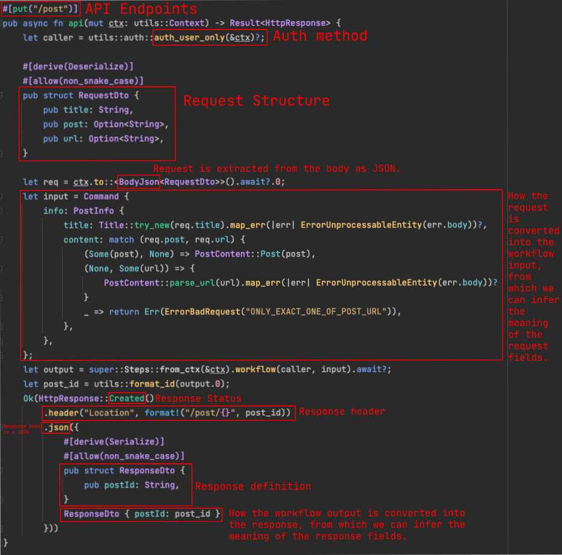

# Rustpost REST API

The REST API service of rustpost using actix-web and sqlx, based on [the Domain Modeling idea from Scott Wlaschin](https://pragprog.com/titles/swdddf/domain-modeling-made-functional/)
and some of my immature ideas.

## Code Structure

* Using [the Vertical Slice Architecture](https://jimmybogard.com/vertical-slice-architecture/), each module
  except `common` represents a workflow and containing the related code.
* Under each workflow package
  * The `mod.rs` contains the domain model. They represent shared model for both programmers and non-programmers.
  * The file with the name `api.rs` includes the information of the interface. This file can serve as API documentation.
    If you are the client side that need to call the API
    or you are writing the API document you can refer to these code.
    
  * The file `error.rs` includes the failure part of the API. It describes what will be responded when a certain failure happens.
  * The file `deps.rs` includes the implementation details of the workflow, mostly the persistence part.
* Under the `common` module
  * `mod.rs` includes the shared domain models.
  * `error.rs` includes the shared failures.
  * `api.rs` includes the shared API information.
  * `db.rs` contains some utils that help for creating SQL statement. It's far from an ORM but better than nothing.

## Error Design

If an error does not infer the problem of the service itself, but which should be presented to the user and
let user solve it, it's called a failure. The example of a failure can be the invalid value for the certain field or not found.
For the failures, we want them to be presented correctly, so we put the functions creating failure in the `error.rs` files
and is considered as the part of the API, while the other errors are just created in place.

### Value Invalid Design

Note: the invalidation talked about below is only for the failure. If an invalidation is caused by the
client wrong implementation instead of the user input (for example missing a field), the design below does not
apply. In that case a `400 Bad Request` will be responded.

The invalid values can be handled differently. Normally we want to respond a `422 Unprocessable Entity`,
but if the value is from the database we may just log and respond
internal error, or sometimes if the value is for finding something we may respond a `404 Not Found`.

As you can see in `common/error.rs`, for the invalid value failure, it returns an `Invalid` struct with the response body. 
The actual response depends on the workflow implementations.

## Deployment

* Setup MySQL database.
* Execute [setup.sql](./setup.sql) in the database.
* Config by either modifying [.env](./.env) or setting up corresponding environment variables.
* Run the application.

## TODO

* Better authorization token mechanism.
